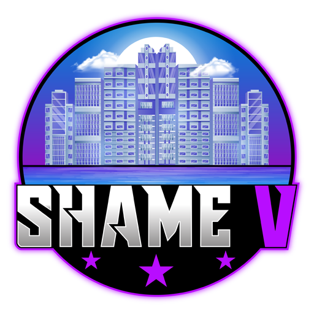

<a name="readme-top"></a>

[![Contributors][contributors-shield]][contributors-url]
[![Forks][forks-shield]][forks-url]
[![Stargazers][stars-shield]][stars-url]
[![Issues][issues-shield]][issues-url]
[![MIT License][license-shield]][license-url]
[![LinkedIn][linkedin-shield]][linkedin-url]


<!-- PROJECT LOGO -->
<br />
<div align="center">
  <a href="https://github.com/sledgehamm3r/sicherheitsgurt">
    
  </a>

  <h3 align="center">Anschnallscript für FiveM</h3>

  <p align="center">
    Anschnallscript für FiveM mit visueller Warnung sowie Soundeffekten
    <br />
    <a href="https://github.com/sledgehamm3r/sicherheitsgurt"><strong>Dokumentation ansehen »</strong></a>
    <br />
    <br />
    <a href="https://github.com/sledgehamm3r/sicherheitsgurt">Demo</a>
    ·
    <a href="https://github.com/sledgehamm3r/sicherheitsgurt/issues">Bug melden</a>
    ·
    <a href="https://github.com/sledgehamm3r/sicherheitsgurt/issues">Anfrage stellen</a>
  </p>
</div>


<!-- TABLE OF CONTENTS -->
<details>
  <summary>Inhaltsverzeichnis</summary>
  <ol>
    <li>
      <a href="#about-the-project">Über das Projekt</a>
      <ul>
        <li><a href="#built-with">Erstellt mit</a></li>
      </ul>
    </li>
    <li>
      <a href="#getting-started">Verwendung</a>
      <ul>
        <li><a href="#prerequisites">Voraussetzungen</a></li>
        <li><a href="#installation">Installation</a></li>
      </ul>
    </li>
    <li><a href="#usage">Benutzung</a></li>
    <li><a href="#roadmap">Roadmap</a></li>
    <li><a href="#contributing">Contributing</a></li>
    <li><a href="#license">License</a></li>
    <li><a href="#contact">Kontakt</a></li>
    <li><a href="#acknowledgments">Danksagungen</a></li>
  </ol>
</details>


<!-- ABOUT THE PROJECT -->
## Über das Projekt

[![Product Name Screen Shot][product-screenshot]](https://example.com)

Das Realistische Anschnallsystem für FiveM ist ein leistungsstarker Script, der eine immersive Erfahrung in der virtuellen Welt von FiveM bietet. Dieses Script simuliert das Anschnallen und bietet visuelle und akustische Rückmeldungen, um die Spieler daran zu erinnern, wie wichtig es ist, sich im Straßenverkehr sicher zu verhalten.

Funktionen:
* Visuelle Anzeige: Das Script zeigt ein deutlich erkennbares Icon an, das den Spieler darauf hinweist, ob er angeschnallt ist oder nicht. Sobald das Fahrzeug eine Geschwindigkeit von 20 km/h erreicht, wird das Icon sichtbar, um die Spieler an ihre Sicherheit zu erinnern.
* Realistische Unfalldarstellung: Wenn ein Spieler nicht angeschnallt ist und einen Unfall erleidet, wird er aus dem Fahrzeug geschleudert. Dieses Feature vermittelt eine realistische Konsequenz für unverantwortliches Verhalten und fördert so das Bewusstsein für Verkehrssicherheit.
* Akustische Rückmeldung: Durch Drücken der Taste "K" kann sich der Spieler anschnallen oder abschnallen. Beim Betätigen dieser Taste ertönt ein Gurtgeräusch, das den Vorgang des Anschnallens bzw. Abschnallens akustisch begleitet. Dadurch wird die Immersion verstärkt und die Spieler ermutigt, sich aktiv mit dem Anschnallsystem auseinanderzusetzen.
* Config.lua: Der Script hat eine Config.lua, in welcher ihr alles notwenidge ohne große Kenntnisse nach euren Bedürfnissen anpassen könnt!

Das Realistische Anschnallsystem ist speziell für FiveM entwickelt worden und kann nahtlos in deine bestehende Server- oder Client-Ressourcen integriert werden. Es ist einfach zu installieren und zu konfigurieren, und wir haben ausführliche Dokumentationen bereitgestellt, um den Einstieg zu erleichtern.


<p align="right">(<a href="#readme-top">back to top</a>)</p>


<!-- GETTING STARTED -->
## Getting Started

This is an example of how you may give instructions on setting up your project locally.
To get a local copy up and running follow these simple example steps.

### Prerequisites

This is an example of how to list things you need to use the software and how to install them.
* npm
  ```sh
  npm install npm@latest -g
  ```

### Installation

_Below is an example of how you can instruct your audience on installing and setting up your app. This template doesn't rely on any external dependencies or services._

1. Get a free API Key at [https://example.com](https://example.com)
2. Clone the repo
   ```sh
   git clone https://github.com/your_username_/Project-Name.git
   ```
3. Install NPM packages
   ```sh
   npm install
   ```
4. Enter your API in `config.js`
   ```js
   const API_KEY = 'ENTER YOUR API';
   ```

<p align="right">(<a href="#readme-top">back to top</a>)</p>


<!-- USAGE EXAMPLES -->
## Usage

Use this space to show useful examples of how a project can be used. Additional screenshots, code examples and demos work well in this space. You may also link to more resources.

_For more examples, please refer to the [Documentation](https://example.com)_

<p align="right">(<a href="#readme-top">back to top</a>)</p>


<!-- ROADMAP -->
## Roadmap

- [x] Add Changelog
- [x] Add back to top links
- [ ] Add Additional Templates w/ Examples
- [ ] Add "components" document to easily copy & paste sections of the readme
- [ ] Multi-language Support
    - [ ] Chinese
    - [ ] Spanish

See the [open issues](https://github.com/othneildrew/Best-README-Template/issues) for a full list of proposed features (and known issues).

<p align="right">(<a href="#readme-top">back to top</a>)</p>


<!-- CONTRIBUTING -->
## Contributing

Contributions are what make the open source community such an amazing place to learn, inspire, and create. Any contributions you make are **greatly appreciated**.

If you have a suggestion that would make this better, please fork the repo and create a pull request. You can also simply open an issue with the tag "enhancement".
Don't forget to give the project a star! Thanks again!

1. Fork the Project
2. Create your Feature Branch (`git checkout -b feature/AmazingFeature`)
3. Commit your Changes (`git commit -m 'Add some AmazingFeature'`)
4. Push to the Branch (`git push origin feature/AmazingFeature`)
5. Open a Pull Request

<p align="right">(<a href="#readme-top">back to top</a>)</p>


<!-- LICENSE -->
## License

Distributed under the MIT License. See `LICENSE.txt` for more information.

<p align="right">(<a href="#readme-top">back to top</a>)</p>


<!-- CONTACT -->
## Contact

Your Name - [@your_twitter](https://twitter.com/your_username) - email@example.com

Project Link: [https://github.com/sledgehamm3r/sicherheitsgurt](https://github.com/sledgehamm3r/sicherheitsgurt)

<p align="right">(<a href="#readme-top">back to top</a>)</p>


<!-- ACKNOWLEDGMENTS -->
## Acknowledgments

Use this space to list resources you find helpful and would like to give credit to. I've included a few of my favorites to kick things off!

* [Choose an Open Source License](https://choosealicense.com)
* [GitHub Emoji Cheat Sheet](https://www.webpagefx.com/tools/emoji-cheat-sheet)
* [Malven's Flexbox Cheatsheet](https://flexbox.malven.co/)
* [Malven's Grid Cheatsheet](https://grid.malven.co/)
* [Img Shields](https://shields.io)
* [GitHub Pages](https://pages.github.com)
* [Font Awesome](https://fontawesome.com)
* [React Icons](https://react-icons.github.io/react-icons/search)

<p align="right">(<a href="#readme-top">back to top</a>)</p>


<!-- MARKDOWN LINKS & IMAGES -->
<!-- https://www.markdownguide.org/basic-syntax/#reference-style-links -->
[contributors-shield]: https://img.shields.io/github/contributors/othneildrew/Best-README-Template.svg?style=for-the-badge
[contributors-url]: https://github.com/othneildrew/Best-README-Template/graphs/contributors
[forks-shield]: https://img.shields.io/github/forks/othneildrew/Best-README-Template.svg?style=for-the-badge
[forks-url]: https://github.com/othneildrew/Best-README-Template/network/members
[stars-shield]: https://img.shields.io/github/stars/othneildrew/Best-README-Template.svg?style=for-the-badge
[stars-url]: https://github.com/othneildrew/Best-README-Template/stargazers
[issues-shield]: https://img.shields.io/github/issues/othneildrew/Best-README-Template.svg?style=for-the-badge
[issues-url]: https://github.com/othneildrew/Best-README-Template/issues
[license-shield]: https://img.shields.io/github/license/othneildrew/Best-README-Template.svg?style=for-the-badge
[license-url]: https://github.com/othneildrew/Best-README-Template/blob/master/LICENSE.txt
[linkedin-shield]: https://img.shields.io/badge/-LinkedIn-black.svg?style=for-the-badge&logo=linkedin&colorB=555
[linkedin-url]: https://linkedin.com/in/othneildrew
[product-screenshot]: images/screenshot.png
[Next.js]: https://img.shields.io/badge/next.js-000000?style=for-the-badge&logo=nextdotjs&logoColor=white
[Next-url]: https://nextjs.org/
[React.js]: https://img.shields.io/badge/HTML-20232A?style=for-the-badge&logo=html&logoColor=61DAFB
[React-url]: https://reactjs.org/
[Vue.js]: https://img.shields.io/badge/Vue.js-35495E?style=for-the-badge&logo=vuedotjs&logoColor=4FC08D
[Vue-url]: https://vuejs.org/
[Angular.io]: https://img.shields.io/badge/Angular-DD0031?style=for-the-badge&logo=angular&logoColor=white
[Angular-url]: https://angular.io/
[Svelte.dev]: https://img.shields.io/badge/Svelte-4A4A55?style=for-the-badge&logo=svelte&logoColor=FF3E00
[Svelte-url]: https://svelte.dev/
[Laravel.com]: https://img.shields.io/badge/Laravel-FF2D20?style=for-the-badge&logo=laravel&logoColor=white
[Laravel-url]: https://laravel.com
[Bootstrap.com]: https://img.shields.io/badge/Bootstrap-563D7C?style=for-the-badge&logo=bootstrap&logoColor=white
[Bootstrap-url]: https://getbootstrap.com
[JQuery.com]: https://img.shields.io/badge/jQuery-0769AD?style=for-the-badge&logo=jquery&logoColor=white
[JQuery-url]: https://jquery.com 
